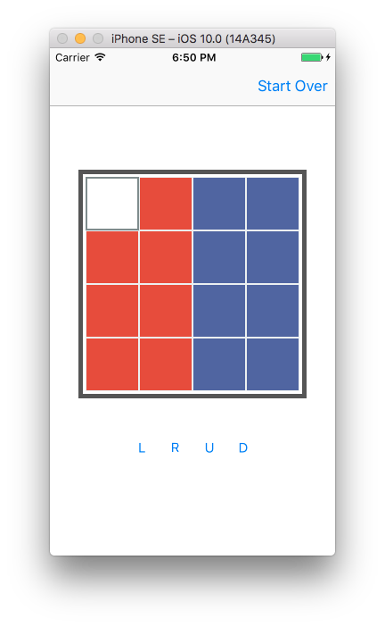
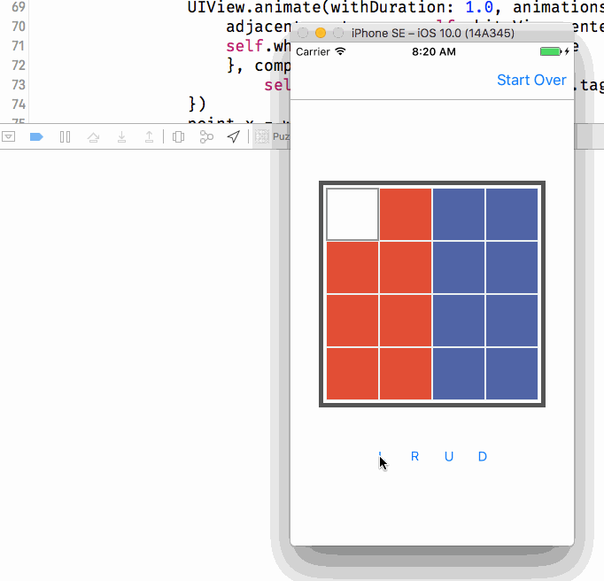

#PuzzleGame
###Dive in Swift 3.0 and Xcode 8.0

####10 Oct. 2016

I have no idea where it's going, let it be fun.

####11 Oct. 2016

Good morning! I just add some code to it, now you can move them in four direction.

What I learned is some recap from highschool math, find tag of the adjacent view, in a matrix liked context. And a concept reinforced which is a view's center and frame property is defined in it's _neareast_ superView coordinate system. Also, what Apple says in their documents that view's position may be different in `viewDidLoad` and `viewDidLayoutSubview` is true!

